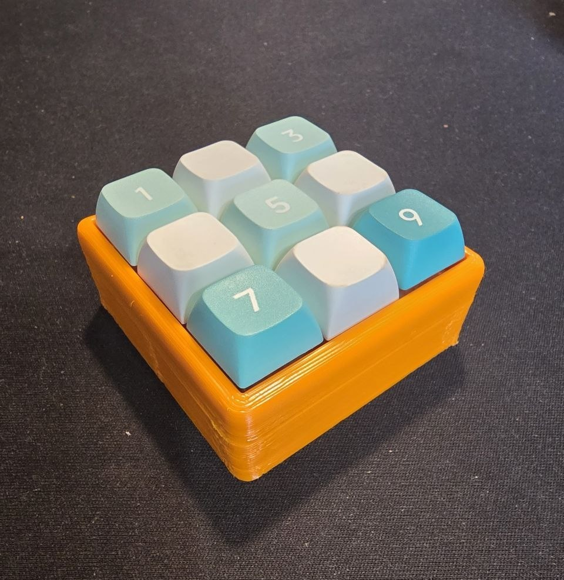

# 🎮 Raspberry Pi Pico Macropad

Проект программируемой макропады на базе Raspberry Pi Pico с использованием CircuitPython. Устройство эмулирует клавиатуру HID и позволяет назначать произвольные макросы на кнопки.

## 📋 Содержание

- [Особенности](#-особенности)
- [Необходимые компоненты](#-необходимые-компоненты)
- [Установка и настройка](#-установка-и-настройка)
  - [1. Прошивка CircuitPython](#1-прошивка-circuitpython)
  - [2. Установка драйверов](#2-установка-драйверов)
  - [3. Настройка макропады](#3-настройка-макропады)
- [Структура проекта](#-структура-проекта)
- [Кастомизация](#-кастомизация)
- [Устранение неполадок](#-устранение-неполадок)

## ✨ Особенности

- 🔧 Поддержка до 9 программируемых кнопок
- ⌨️ Эмуляция HID-клавиатуры
- 🚀 Простая настройка через CircuitPython
- 💾 Возможность создания сложных макросов
- 📁 Легкая кастомизация под свои нужды

## 🔧 Необходимые компоненты

- Raspberry Pi Pico
- Тактовые кнопки (x9)
- Плата для монтажа
- Соединительные провода
- Резисторы (опционально, в зависимости от схемы подключения)

## 🚀 Установка и настройка

### 1. Прошивка CircuitPython

1. **Подключите Raspberry Pi Pico**: зажмите кнопку **BOOTSEL** на плате и подключите к компьютеру через USB
2. **Появится виртуальный диск** `RPI-RP2`
3. **Скачайте последнюю версию CircuitPython** с [официального сайта](https://circuitpython.org/board/raspberry_pi_pico/)
4. **Перетащите UF2-файл** на виртуальный диск `RPI-RP2`
5. Плата автоматически перезагрузится с CircuitPython

### 2. Установка драйверов

1. После прошивки появится диск `CIRCUITPY`
2. Скопируйте содержимое папки `pico_driver` в корень диска `CIRCUITPY`
3. Плата перезагрузится и будет готова к работе

### 3. Настройка макропады

1. **Подключитесь через Thonny IDE** или другую поддерживаемую среду разработки
2. **Выберите интерпретатор CircuitPython** в настройках подключения
3. **Загрузите необходимые библиотеки**:
   - Скопируйте папку `adafruit_hid` в корень диска `CIRCUITPY`
   - Загрузите скрипт `macropad_script_nums.py` для тестирования

